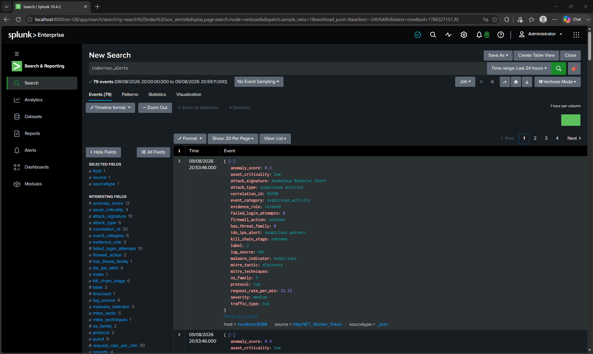

# SplunkSocWorker

> A .NET 8 Worker Service that simulates a SOC alert feed and streams it into Splunk Enterprise via HEC.



---

## 🧩 Problem / Context

Part of a thesis project building a SOC alert triage system with an ML prioritization model. The ML/analyst-facing side (Django + PostgreSQL) needs a realistic, continuous stream of alerts to work against, but there's no live SOC infrastructure to pull from. This Worker plays the role of "the SIEM data source": it takes a dataset of alerts and drip-feeds it into Splunk on a schedule, the same way a real firewall/EDR/IDS would.

---

## 🛠️ Stack

| Layer | Technology |
|---|---|
| Runtime | .NET 8 Worker Service + ASP.NET Core Minimal API |
| CSV/JSON parsing | CsvHelper, System.Text.Json |
| Logging | Serilog (console + rolling file sink) |
| Ingestion target | Splunk Enterprise — HTTP Event Collector (HEC) |
| Related backend | Django + PostgreSQL, ML alert prioritization (separate repo) |
| Deploy / Infra | Local dev today; Azure planned for the Django side |

---

## 🏗️ Architecture

- Single project, folder-by-responsibility (`Models/`, `Services/`, `BackgroundServices/`, `Endpoints/`, `Middleware/`) — no Clean Architecture layers, no CQRS. Two use cases (upload a dataset, send a batch) don't justify that ceremony.
- `WebApplication` + a `BackgroundService` share one process: a Minimal API endpoint accepts the dataset, a timer-driven service samples and sends batches (woken up early by new uploads, not just on a fixed schedule) — added `Microsoft.AspNetCore.App` as a `FrameworkReference` to a `Sdk.Worker` project instead of running two separate apps.
- No shared database with the Django backend, even though PostgreSQL on Azure will be network-reachable. Two independently deployed services writing to the same schema couples their deployments; this Worker only ever talks to Splunk.
- Batches are sent as a single bulk NDJSON request to Splunk HEC, not one HTTP call per event.

Full writeup with diagrams: [docs/architecture.md](docs/architecture.md).

---

## 🧠 Technical challenges & decisions

- **Problem:** a `Microsoft.NET.Sdk.Worker` project has no built-in way to host an HTTP endpoint. → **Solution:** added a `Microsoft.AspNetCore.App` `FrameworkReference` and switched `Program.cs` to `WebApplication.CreateBuilder`. → **Why:** the dataset upload (HTTP) and the batch sender (background timer) needed to share one process, one DI container, one config system — not two separate apps talking over a socket.
- **Problem:** the real-world CSV export used for testing had 93 columns, including 51 one-hot MITRE technique flags, and no `mitre_techniques` field — it didn't match the schema initially modeled from an illustrative example. → **Solution:** cross-referenced the actual Django `Alert` model, its DRF serializer, and its upload pipeline as the source of truth, reduced the schema to the 22 fields genuinely consumed downstream, and marked `mitre_techniques` optional. → **Why:** verified against real data — the first version would have thrown `HeaderValidationException` on that exact file; caught by actually running the endpoint against it, not just reading the code.
- **Problem:** an unhandled exception on the upload endpoint returned a raw stack trace to the caller. → **Solution:** `IExceptionHandler` (`Middleware/GlobalExceptionHandler.cs`) wired in globally via `UseExceptionHandler()`. → **Why:** one place to catch every HTTP-level failure — current and future endpoints — instead of a `try/catch` per handler.
- **Problem:** logs only went to the console and were lost on restart, and there's no error-reporting endpoint on the Django side to send them to instead. → **Solution:** Serilog with a rolling daily file sink, fully decoupled from both Splunk and Django. → **Why:** the most likely failure (Splunk unreachable) can't be logged *into* Splunk — a local file is the only sink guaranteed to work no matter what else in the system is down.

---

## 🚀 How to run it

**CLI / VS Code:**

```bash
# 1. Set the Splunk HEC token (never commit it — see docs/technical.md)
dotnet user-secrets set "Hec:Token" "<your-hec-token>"

# 2. Run the Worker
cd SplunkSocWorker
dotnet run
```

**Visual Studio 2022:**

1. Open `SplunkSocWorker.sln`.
2. Right-click the `SplunkSocWorker` project → **Manage User Secrets** → add the token in the editor that opens:
   ```json
   { "Hec": { "Token": "<your-hec-token>" } }
   ```
   (same underlying mechanism as `dotnet user-secrets set`, just a GUI for it.)
3. Press **F5** (with debugging) or **Ctrl+F5** (without) — the `SplunkSocWorker` launch profile from `Properties/launchSettings.json` is used automatically.

Listens on `https://localhost:7000` / `http://localhost:5000` by default (`Properties/launchSettings.json`).

```bash
# Upload a dataset
curl -X POST "http://localhost:5000/api/v1/dataset/upload" \
  -F "file=@your-dataset.csv"
```

More: 

- [docs/technical.md](docs/technical.md) (setup, config, dependencies) 

- [docs/api-reference.md](docs/api-reference.md) (endpoint + alert schema).

---

## 🔗 Related links

- Backend / ML API: [soc-alert-prioritization-ml](https://github.com/Carlou134/soc-alert-prioritization-ml) — Django + PostgreSQL, alert prioritization model.

- Talks to Splunk independently; does not consume this Worker directly.
