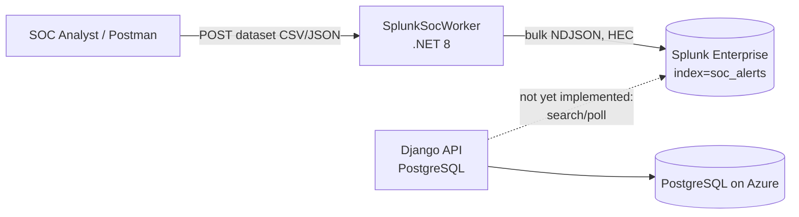

# Architecture

## System context

This Worker is one of two independently deployed services in the thesis project:



The Worker's only job is to **produce** simulated alert traffic into Splunk, the same way a firewall, EDR, or IDS/IPS would. It does not talk to the Django backend directly — there is no shared database and no direct HTTP call between the two services. Splunk is the sole integration point between "alert source" and "alert consumer," and as of this writing the Django side only has a connectivity health-check against Splunk's management API (port 8089); it does not yet pull alerts from Splunk.

This separation is deliberate: the Worker and the Django API are built, deployed, and can fail independently. Neither depends on the other being up.

## Component layout

```
SplunkSocWorker/
├── Program.cs                          # composition root: DI, Serilog, exception handler, HTTP pipeline
├── Models/
│   ├── AlertRecord.cs                  # the alert payload — mirrors the Django Alert/serializer contract
│   └── HecEvent.cs                     # the Splunk HEC envelope (time/index/sourcetype/event)
├── Services/
│   ├── AlertRecordParser.cs            # CSV (CsvHelper) / JSON (System.Text.Json) -> List<AlertRecord>
│   ├── AlertsDatasetPool.cs            # in-memory dataset + JSON file persistence
│   ├── IHecClient.cs / HecClient.cs    # typed HttpClient, bulk NDJSON POST to Splunk HEC
├── BackgroundServices/
│   └── BatchSenderWorker.cs            # BackgroundService, PeriodicTimer, samples + sends batches
├── Endpoints/
│   └── DatasetEndpoints.cs             # Minimal API: POST /api/v1/dataset/upload
├── Middleware/
│   └── GlobalExceptionHandler.cs       # IExceptionHandler for the HTTP pipeline
├── Data/                               # runtime dataset cache (gitignored)
└── Logs/                               # Serilog rolling file output (gitignored)
```

Files are grouped by responsibility (models / services / background jobs / HTTP surface), not by feature or layer. There is no separate Domain/Application/Infrastructure split.

## Key design decisions

### No Clean Architecture, no CQRS

The Worker has exactly two write paths: "load a dataset" and "send a batch." CQRS exists to separate read and write models when they diverge in complexity or scale independently — with two use cases and no read model at all, introducing commands/handlers (with or without MediatR) would add indirection without solving a real problem. A flat, single-project, folder-by-responsibility layout was chosen instead. If the project grows a second bounded context (e.g., a real query surface over historical alerts), this decision should be revisited.

### Minimal API bolted onto a Worker Service

The project still uses `Sdk="Microsoft.NET.Sdk.Worker"`, not `Sdk.Web`. To expose the upload endpoint, `<FrameworkReference Include="Microsoft.AspNetCore.App" />` was added to the `.csproj`, and `Program.cs` uses `WebApplication.CreateBuilder` instead of `Host.CreateApplicationBuilder`. This lets a `BackgroundService` (the batch sender) and a Minimal API endpoint (the uploader) share one process, one DI container, and one configuration system, instead of running two separate applications.

### Dataset storage: in-memory + flat JSON file, not a database

`AlertsDatasetPool` is a singleton holding the current dataset in memory, mirrored to `Data/alerts_pool.json` on disk so it survives a restart. There is no database in this service. A single-writer simulation tool that only needs "the last uploaded dataset" does not need a relational store, migrations, or a query engine — a flat file is the simplest thing that satisfies the requirement.

This is also why the Worker does **not** write to the Django/PostgreSQL database directly, even though it is technically reachable once deployed to Azure. Two independently deployed codebases writing to the same schema is a "shared database" integration — a migration on the Django side (e.g., adding a `NOT NULL` column) can silently break the Worker with no compile-time signal across repositories. If cross-service error visibility is ever needed, the correct integration is an HTTP API contract owned by Django, not direct table access.

### Error handling: middleware for HTTP, try/catch for the background loop

`GlobalExceptionHandler` (`IExceptionHandler`, the .NET 8-native pattern) wraps the whole HTTP pipeline via `app.UseExceptionHandler()` — any unhandled exception in `DatasetEndpoints` is logged and turned into a clean `500` JSON response instead of a raw stack trace. Middleware only exists for the HTTP request pipeline, so it does not apply to `BatchSenderWorker`'s timer loop; that one uses an explicit `try/catch` around the per-tick send so a single failed Splunk call (e.g., Splunk unreachable) is logged and does not stop the loop.

### Logging: local file, independent of Splunk and Django

Serilog writes to both the console and a rolling daily file (`Logs/worker-.log`, 14-day retention). This is deliberately the *only* place errors are guaranteed to persist: if Splunk is down, the Worker cannot log "Splunk is down" *into* Splunk (circular), and there is no error-reporting endpoint on the Django side to fall back to either. A local file works regardless of what else in the system is unavailable.

### Bulk send instead of one request per event

Splunk HEC supports both a single-event endpoint (`/services/collector/event`) and a bulk endpoint (`/services/collector`) that accepts newline-delimited JSON (NDJSON). `HecClient.SendBulkAsync` uses the bulk endpoint so a batch of 15-30 alerts is one HTTP request instead of up to 30.

### The pool is consumed, not resampled

`AlertsDatasetPool.TakeRandomBatchAsync` removes the sampled records from the in-memory pool (and re-persists the shrunken remainder to disk) instead of sampling with replacement. Each alert in an uploaded dataset is sent to Splunk **at most once** — earlier versions resampled the same pool every tick, which meant the same alert could be sent again in a later batch and Splunk would show more accumulated events than rows in the source dataset (e.g. two ticks of 15 and 24 producing 39 indexed events from a 30-row upload). Once the pool is exhausted, `BatchSenderWorker` logs it and waits for a new upload — it does not loop back to the start.
